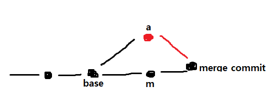
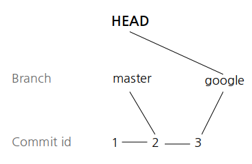
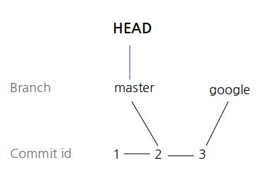
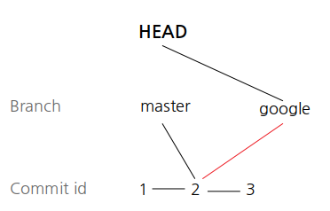
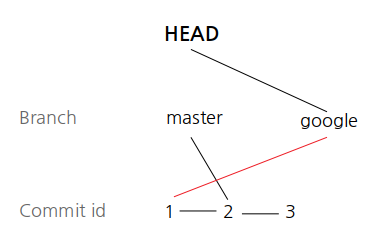

[호눅스](https://github.com/honux77/practice/wiki/learngit)님의 깃허브를 참고하여 공부하였다.

[영상 강의](https://opentutorials.org/course/3838)

  - https://opentutorials.org/course/3838

[참고서](https://backlog.com/git-tutorial/kr/)

  - https://backlog.com/git-tutorial/kr/

[교재](https://git-scm.com/book/ko/v2)

  - https://git-scm.com/book/ko/v2

## 22.09.26

# Git - 버전관리

## 버전 생성

- 프로젝트 파일에 들어가서 `git init .`을 통해 버전 관리를 시작한다. `.git`이라는 파일이 생기고 이 파일이 버전 정보를 기록한다.

- 파일들은 **Working tree**, **Staging Area**, **Repasitory**로 나뉜다.

  - **Working tree**는 작업한 파일들이고 그 중 버전을 만들 파일들을 **Staging Area**에 올린다.  
  그리고 그 파일들을 git이 버전으로 만들어서 **Repasitory**에 올린다.

- `git config --global core.editor "nano"` : git의 기본 에디터를 나노로 변경한다. 익숙치않은 에디터가 나오지 않게하기위해 사용한다.
 `git status` : Working tree의 상태를 볼 수 있다.    
 `git add` : Staging Area에 올릴 수 있다.  
 `git commit` : 버전을 생성할 수 있다.  
 `git log` : 버전들을 볼 수 있다.  
 `git log --stat` : 어떤 파일들이 commit 되었는지(버전관리 대상에 포함되었는지) 볼 수 있다. 이런 옵션들은 구글링으로 해결하자.  
 `git diff` : 이전 버전에 대해 수정사항을 보여준다.  
 `git log -p` : 이전 버전에 대한 수정사항을 파일별로 더 자세히 보여준다.  
 `git commit -am` : 모든 파일들을 add하면서 commit한다. 단, Untracked 파일이 있으면 실행이 안되므로 한 번도 add하지 않은 파일은 안된다.  
 
- 한 번도 `add`하지 않은 파일의 status는 *Untracked*라고 표시된다. 아직 Staging Area에 없어서 git이 인식할 수 없다는 뜻이다.    
 한 번이라도 `add`한 파일의 status는 *Changes not staged*라고 표시된다. 수정사항이 Staging Area에 안올라갔다는 뜻이다.

## 버전 변경

- git log를 해보면 `(HEAD -> Master)`라는 표시와 버전별 `commit id`가 뜬다. 헤드가 Master노드를 가리키고 있다는 뜻이다.

- `git checkout <commit id>` : 특정 commit 버전으로 되돌아간다. `git checkout master`로 원래대로 돌아올 수 있다.

## 22.09.30

## 버전 삭제

- `git 명령어 --help` : 명령어에 대한 도움말을 볼 수 있다.

- `git reset --hard commit id` : `commit id`로 버전을 리셋한다. 해당 commit id를 리셋하는것이 아님을 주의하자. 
	hard옵션을 쓰면 우리가 수정하고 있던 것 모두 삭제한다. 즉 `commit id`의 버전으로 코드가 돌아가는 것이다.
  
  - 수정하던것을 놔두고 삭제하려면 다른 옵션을 사용하면 된다.
  
 
## 버전 되돌리기

- `git revert <commit id>` : \<commit id>의 수정사항을 모두 제거한 버전을 새로 생성한다. 새로 생성된 버전은 \<commit id> 이전 버전의 코드이며  
 새로운 버전을 생성하는 것이므로 커밋 메시지를 작성해줘야한다. 단, **한 단계씩 되돌아가야 한다.**
 
  - Example  
  ###
  **git log**  
  ```
  commit 4(commit id) message R4
  commit 3(commit id) message R3
  commit 2(commit id) message R2
  commit 1(commit id) mesaage R1
  ```
    **git revert 4**
  ```
  commit 5(commit id) mesaage Revert R4
  commit 4(commit id) message R4
  commit 3(commit id) message R3
  commit 2(commit id) message R2
  commit 1(commit id) mesaage R1
  ...
  ```  
  R4를 revert했더니 R3의 내용을 가지고있는 새로운 버전(5)이 생성되었다. 즉 버전의 보존과 동시에 내가 원하는 버전으로 되돌아 간 것이다.  
  
  
  - R1으로 되돌아가고 싶다고 **git revert 2**를 하게되면 충돌이 일어난다. 따라서 꼭 순차적으로 **git revert 3**, **git revert 2**와 같이 해줘야 한다.  
  그 이유는 git revert 2는 현재 버전에서 버전2에서 생긴 변화를 제거하고 그 버전을 생성하는 것이다.  
  그래서 바로 git revert 2를 하게되면 버전2 이후에 생긴 변화인 버전3을 제대로 인식하지 못해서 충돌이 일어난다.
  
# Git - Branch & Confilict

## Branch의 기본 사용법

- `git log --all` : 모든 브랜치의 git log를 볼 수 있다.  
  `git log -- oneline` : git log를 한 줄로 볼 수 있다.  
  `git log --graph` : git log를 그래프 형태로 볼 수 있다.  
  `git branch` : 현재 만들어진 branch를 볼 수 있다. 현재 브랜치는 앞에 \*이 붙고 기본적으로 master브랜치가 생성되어 있다.  
  `git branch <branch name>` : \<branch name>의 이름을 가진 브랜치를 생성한다.  
  `git checkout <branch name>` : \<branch name>의 브랜치로 이동한다.
  
  - Example  
  work 1 커밋에서는 빈 파일에 *content 1*이 추가된다.  
  work 2 커밋에서는 위의 파일에 *content 2*가 추가된다.  
  work 3 커밋에서는 위의 파일에 *content 3*가 추가된다. 
  ###
  
    **git log --all --graph --oneline**  
    ```
    3 (HEAD -> master) work 3
    2 work 2
    1 work 1
    ```  
	
	**git branch**
	```
	* master
	```  
	
	**git branch apple**  
	**git log --all --graph --oneline**  
	```
	3 (HEAD -> master, apple) work 3
    2 work 2
    1 work 1
	```
	
    **git branch google**  
	**git log --all --graph --oneline**  
	```
	3 (HEAD -> master, apple, google) work 3
    2 work 2
    1 work 1
	```
    이 때 apple, google 브랜치 모두 work 3 상태에서 만들어서 같은 커밋을 공유한다.  
	그리고 마스터 브랜치에서 파일에 contnet 4를 추가하고 add, commit했다고 하자.  
	###
	**git log --all --graph --onelin**
	```
	4 (HEAD -> master) work 4
	3 (apple, google) work 3
    2 work 2
    1 work 1
	```
	
	**git checkout apple**  
	**git log --all --graph --onelin**  
	```
	4 (master) work 4
	3 (HEAD -> apple, google) work 3
    2 work 2
    1 work 1
	```
	git checkout을 하면 위와같이 로그가 바뀌고 **파일의 내용 또한 apple의 마지막 커밋 상태로 돌아가게 된다.** 즉 content4가 사라진다.  
	나는 브랜치를 멀티 유니버스 정도로 이해하고 있다. git branch branch name을 할 때 마다 새로운 유니버스가 생성되고 checkout을 하면 다른 유니버스로 이동한다고 이해하였다.
	
##  브랜치 병합

- master브랜치에서 작업을 하다가 a브랜치를 만들어서 작업을 하고 커밋을 하였다. 또 마스터 브랜치에서도 작업을 계속 하고 커밋을 하였다.  
 그런데 이 다른 두 브랜치를 한 브랜치로 병합하고싶다. 이 때 a브랜치와 마스터 브랜치의 공통 조상 브랜치를 **base branch**라고 한다.  
 합치고 난 후의 브랜치를 **merge commit**라고 한다.  
 ###
 
  
 
## 3 way merge

- 두 브랜치를 병합하는 과정에서 충돌이 일어날 수 있다. 처음에는 병합하려는 두 브랜치의 수정사항을 비교해서 공통 부분만 병합하고 아닌 부분은 충돌로 처리하였고  
 이 방법을 **2 way merge**라고 하였다.

- **3 way merge**는 베이스 브랜치도 이용하여 병합하려는 두 브랜치 수정사항이 일치하지 않는다면, **베이스 브랜치에서 수정한 부분으로 병합하는 방법이다.**   
 물론 두 브랜치 모두에서 수정을 한 부분이 있다면 충돌로 처리한다.  
 ###
  | **a** 	| **base** 	| **b** 	| **2 way merge** 	| **3 way merge** 	|
  |----------------	|-----------------	|-----------------	|-----------------	|-----------------	|
  | A              	| A               	| A               	| A               	| A               	|
  | H              	| B               	| B               	|        ?        	| H               	|
  | C              	| C               	| T               	|        ?        	| T               	|
  | H              	| D               	| T               	|        ?        	|        ?        	|
 
## 22.10.01

## 외부 도구를 이용해서 병합하는 방법

- `git merge <branch name>` : 현재 브랜치에 \<branch name>브랜치를 병합한다. 3-way merge를 이용하며 충돌이 일어나면 수동으로 수정해야 한다.

  - Example  
  3 way merge의 예시를 이용해보자. 현재 브랜치를 a라고 하고 `git merge b`를 하게되면 해당 파일이 아래와 같이 변한다.
  ```
  A
  H
  T
  <<<<<<< HEAD
  H
  =======
  T
  >>>>>>> b
  ```
  위의 충돌이 일어난 부분을 수동으로 해결해줘야한다. 이 때 외부 도구를 이용하면 편하게 병합할 수 있다.
  
-  `git mergetool` : mergetool을 실행한다.   
	P4merge등의 머지툴을 다운받고 git merge tool을 git config를 통해 P4merge로 설정하면 툴을 사용할 수 있다. 

## HEAD BRANCH COMMIT

- 헤드와 브랜치, 커밋의 관계를 더 잘 이해해보자. 구글 브랜치를 2번 커밋일 때 만들고, 구글 브랜치에서 3번 커밋을 하면 아래 그림과 같이 된다.  
    
  ###   
  이 때 `git checkout`은 HEAD를 제어한다. 그걸 따라 가서 우리는 2번 커밋 상태의 파일을 본다. 따라 따라 들어가면서 브랜치와 커밋을 확인한다고 이해하면 편하다.  

- `git checkout 1`처럼 커밋아이디를 HEAD가 바로 가리킬 수 있다. 그 상태를 브랜치로부터 떨어져 있는 **detached**상태라고 한다.

- 위에서 든 예시의 상태일 때 `checkout master`는 아래와 같이 작동한다.  
      
  ###  
  `reset master`는 현재 브랜치가 master가 가리키는 commit과 같은 것을 가리키게 하므로 아래와 같이 작동한다.  
    
  ###  
  보통은 `reset 1`과 같이 커밋아이디를 직접 지정하는 방식으로 사용한다. 이 때 google브랜치는 1번 커밋을 가리키고  
  나머지 2, 3번 커밋은 자신과는 관계가 없는 커밋이므로 링크를 끊으면서 커밋을 삭제하는 것처럼 작동한다.  
      
  
## 22.10.04

# Backup과 협업

## Remote repasitory

- 우리가 작업을 하면서 소스를 만드는 공간을 지역저장소, 인터넷이나 네트워크 어딘가에 있는 저장소를 원격 저장소라고 한다.  
 다른 사람과 작업 혹은 한 프로젝트에 대한 여러 지역저장소 운영을 위해 사용하며 Git hosting을 통해 사용할 수 있다.  
 대표적으로 *Github*, *Gitlab*이 있다.
 
- `git remote` : 현재 지역저장소(프로젝트)에 연결된 원격저장소를 확인한다. `-v`옵션을 주어 URL과 원격저장소 이름을 볼 수 있다.  
 `git remote add <저장소이름> <url>` : \<url>의 원격저장소를 연결한다. 원격저장소 이름은 <저장소이름>으로 설정한다.  
 `git push <원격저장소 이름> <브랜치 이름>` : \<브랜치이름> 브랜치를 원격저장소에 업로드한다.  
   
   - 보통 `git push origin master`와 같이 사용한다.  
   
  `git push -u origin master` : `git push`만 입력했을 때 자동으로 `git push origin master`가 실행되게 한다.  
  `git clone <url>` : \<url>의 원격저장소를 복제한다. 원격저장소 이름의 폴더가 생성되면서 복제되며 폴더 이름을 바꾸려면 명령어 맨 끝에 폴더명을 넣으면 된다. 저장소를 clone하면 `origin`이라는 리모트 저장소가 자동으로 등록된다.
  `git fetch <원격저장소 이름>` : 원격저장소의 정보를 가져온다. 머지는 해주지 않기 때문에 본인이 직접 확인 후 머지해야 한다.
  `git pull <원격저장소 이름>` : 원격저장소의 정보를 가져오고 브랜치에 병합까지 해준다.
  `git remote rename <저장소 이름> <바꿀 저장소 이름>` : 저장소 이름을 변경한다.  
  `git remote remove <저장소 이름>` : 저장소를 삭제한다.
  
## 협업

- 협업을 할 때에는 한 브랜치에서 작업하면 push를 할 때 충돌이 생길 수 있다. 따라서 pull - commit - push와 같은 순서로 작업을 하게 된다.  
 이 때 협업자의 수정사항을 확인하면서 pull과 push를 최대한 자주 해줘야 충돌을 줄일 수 있다.
  
## 브랜치 워크플로

- Git 개발자가 많이 선호하는 워크플로가 있다. 배포했거나 배포할 코드만 master브랜치에 머지해서 안정 버전 코드만 둔다. 개발을 진행하고 안정화하고 있는 브랜치는 develop브랜치에 둔다. 이 브랜치는 항상 안정화 상태는 아니다.  
 토픽 브랜치도 많이 사용한다. 토픽 브랜치는 어떤 주제나 작업을 위해 만든 짧은 호흡의 브랜치이다.  
 한 이슈를 해결하기 위해, 새로운 아이디어를 도입하기 위해 등 실험실처럼 브랜치를 사용하고 master브랜치에는 안정화된 코드만 넣는 방식을 많이 사용한다.
  